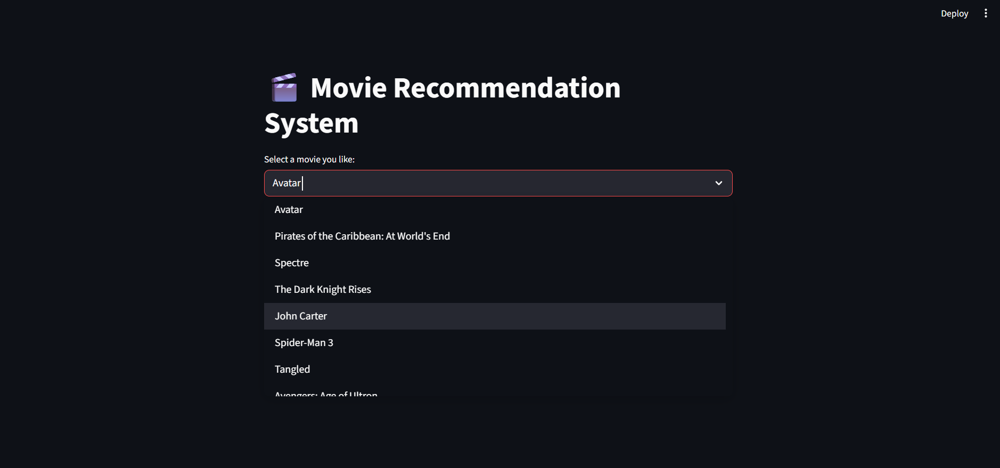
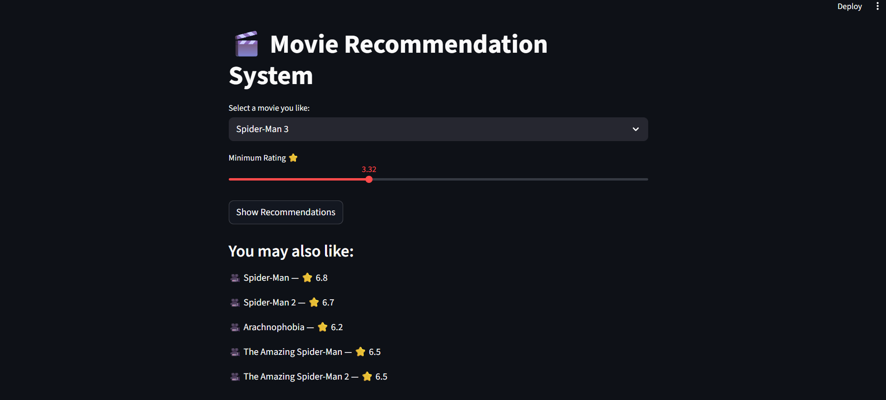

# 🎬 Movie Recommendation System

A content-based movie recommendation system built using Python and Streamlit.  
It recommends movies based on the user-selected movie using TF-IDF and cosine similarity.

---

## 🚀 Features
- Content-based movie recommendation
- Recommends similar movies to the selected movie
- Simple and interactive web interface using Streamlit

---

## 🛠️ Technologies Used
- Python 3.x
- Pandas
- Scikit-learn
- Streamlit

---

## 🖼️ Screenshots

### Home Page


### Movie Recommendations


---

## ▶️ How to Run the Project

1. Clone or download the repository
2. Open the project folder in VS Code
3. Open terminal in the project directory
4. Install required libraries:
   ```bash
   pip install streamlit pandas scikit-learn
